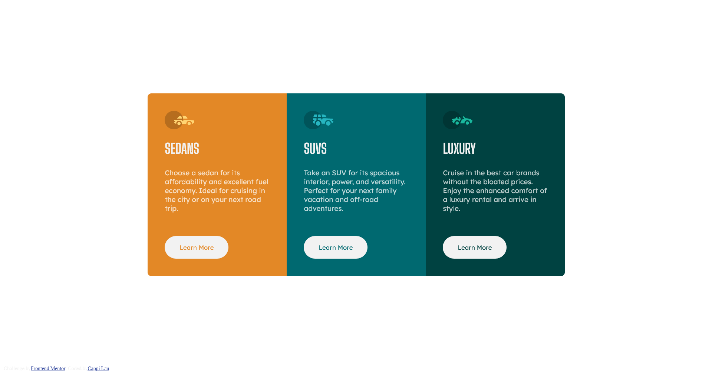

# Frontend Mentor - 3-column preview card component solution

This is a solution to the [3-column preview card component challenge on Frontend Mentor](https://www.frontendmentor.io/challenges/3column-preview-card-component-pH92eAR2-). Frontend Mentor challenges help you improve your coding skills by building realistic projects. 

## Table of contents

- [Overview](#overview)
  - [The challenge](#the-challenge)
  - [Screenshot](#screenshot)
  - [Links](#links)
- [My process](#my-process)
  - [Built with](#built-with)
  - [What I learned](#what-i-learned)
  - [Continued development](#continued-development)
  - [Useful resources](#useful-resources)
- [Author](#author)

## Overview

### The challenge

Users should be able to:

- View the optimal layout depending on their device's screen size
- See hover states for interactive elements

### Screenshot

### Links

- Solution URL: [Solution](https://github.com/lauyc-c/3-component-preview-card-component)
- Live Site URL: [Live site](https://lauyc-c.github.io/3-component-preview-card-component/)

## My process

### Built with

- Semantic HTML5 markup
- CSS custom properties
- Flexbox
- CSS Grid
- Mobile-first workflow

### What I learned

Throughout this project, the key thing I have learnt is to apply media queries to make the components change their orientation with size, as well as familiarizing myself with the "cascading" markup of CSS. Specifically, having the ":hover" pseudo-property come after listing all default button properties.

### Continued development

I found myself not as familiar with using classes and/or ids on specifying components to change when I tried to customize the button colors, both hovered or not.

### Useful resources

- [The Web Developer Bootcamp 2023](https://www.udemy.com/course/the-web-developer-bootcamp/) - This taught me basic HTML and CSS for me to complete this project.
- [MDN](https://developer.mozilla.org/en-US/) - This page provided reference for much of the syntax.

## Author

- Website - [Cappi Lau](https://github.com/lauyc-c)
- Frontend Mentor - [@lauyc-c](https://www.frontendmentor.io/profile/lauyc-c)
